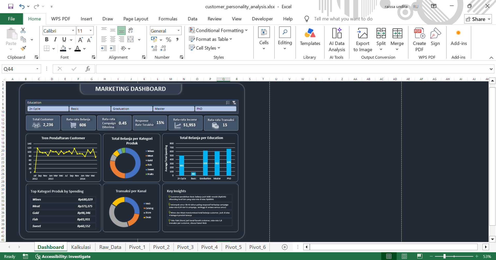
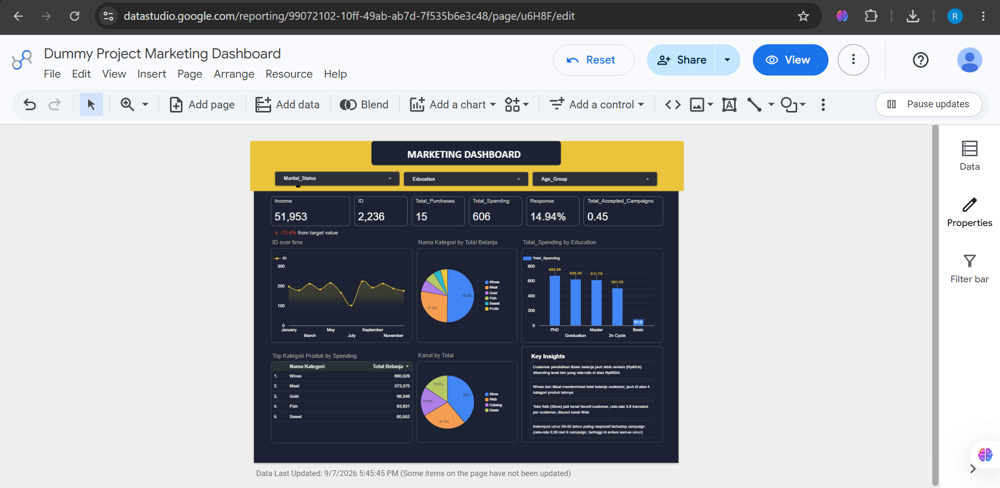

# Customer Personality & Marketing Campaign Analysis Dashboard

A dummy project analyzing customer demographics and marketing campaign performance. This project covers the full workflow: data cleaning, transformation, pivot table analysis, and interactive dashboard creation in both **Microsoft Excel** and **Looker Studio**.

## 📊 Live Dashboard
- **Looker Studio (interactive):** [Open Dashboard](https://datastudio.google.com/reporting/99072102-10ff-49ab-ab7d-7f535b6e3c48)

## 📁 Dataset
This project uses the **Customer Personality Analysis** dataset from Kaggle, containing demographic, purchase history, and marketing campaign response data for 2,240 customers.
- Source: [Kaggle - Customer Personality Analysis](https://www.kaggle.com/datasets/imakash3011/customer-personality-analysis)

## 🎯 Objectives
This project aims to answer several business questions:
- Which customer segments (education, age, marital status) generate the
  highest spending value?
- Which age group is most responsive to marketing campaigns?
- Which product categories and purchase channels are most dominant?
- What does the customer registration trend look like over time?

## 🛠️ Tools Used
- **Microsoft Excel** — data cleaning, transformation, pivot tables, dashboard (KPI cards, charts, slicers)
- **Looker Studio** — web-based interactive dashboard
- **Google Sheets** — data bridge between Excel and Looker Studio

## 🔄 Workflow

### 1. Data Cleaning
- Checked missing values in the `Income` column, imputed with the median
- Removed duplicate records
- Standardized inconsistent categories in the `Marital_Status` column
  (e.g. "YOLO", "Absurd" → "Single")
- Handled outliers in `Year_Birth` (customers with implausible ages) and
  `Income` (an extreme value far outside the normal distribution)

### 2. Data Transformation
Created several helper columns to support analysis:
- `Age` & `Age_Group` — customer age and age bracket
- `Total_Spending` — total spending across 6 product categories
- `Total_Children` — total children at home (Kidhome + Teenhome)
- `Total_Purchases` — total transactions across all channels
- `Total_Accepted_Campaigns` — total campaigns accepted out of 6 campaigns offered

### 3. Pivot Table Analysis
Built several pivot tables to answer key business questions, including:
average spending by education level, average campaign response by age
group, purchase channel patterns by marital status, and the relationship
between number of children and spending/campaign response.

### 4. Excel Dashboard
An interactive dashboard featuring:
- 6 KPI Cards (Total Customers, Average Spending, Average Campaigns Accepted,
  Average Purchases, Average Income, Latest Response Rate)
- Line chart showing monthly customer registration trend
- Donut charts showing spending distribution by product category and by
  purchase channel
- Bar chart showing spending by education level
- Interactive slicer (Education)

### 5. Looker Studio Dashboard
Rebuilt the dashboard in Looker Studio using the same underlying data, with
interactive filter controls (Education, Marital Status, Age Group) that
dynamically filter all charts and KPI cards sourced from customer-level data.

## 💡 Key Insights
- Customers with **Basic** education have a notably lower average spending
  (~$82) compared to other education levels (above $600)
- The **30-45 age group** is the most responsive to marketing campaigns,
  accepting an average of 0.59 out of 6 campaigns
- **Wines** and **Meat** dominate total customer spending, far ahead of the
  other four product categories
- **In-store (Store)** purchases are customers' favorite channel, followed
  by the Web channel

## 📸 Overview

### Excel Dashboard


### Looker Studio Dashboard


## 📂 Repository Structure
```
├── excel/customer_personality_analysis.xlsx # Full Excel workbook (raw data, pivots, dashboard)
├── overview/ # Dashboard and analysis process overview
└── looker-studio/report-link.md # Looker Studio dashboard link
```
## 👤 Author
**Raissa Undita Estiningtyas**
[LinkedIn](https://www.linkedin.com/in/raissaundita/)
